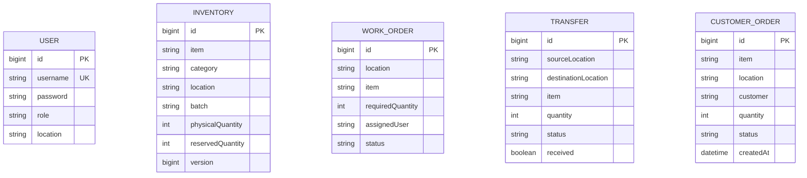

# ER Diagram

Inventory is uniquely constrained by item + location + batch. Transfers represent Requested -> Dispatched -> Received. Reservation and dispatch are transactional and lock the affected inventory row.
